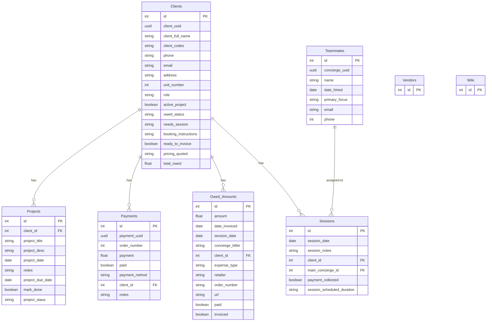

# `Bright-concierge-internal-tool`

Run backend with **npm start** and frontend with **npm run dev**

## Application feature overview

This project manages clients, sessions, projects, payments, and owed amounts for a concierge-style business. It supports full CRUD for Clients, Projects, Sessions, Payments, Owed Amounts, Teammates, Vendors, and Wiki pages, plus nested reads by client and basic query filters.

---

## Database Schema Design

![db-schema]

[db-schema]: ./images/Screenshot%202025-09-08%20190344.png

## API Documentation



**Refs**

* `Clients.id` < `Projects.client_id`
* `Clients.id` < `Payments.client_id`
* `Clients.id` < `Owed_Amounts.client_id`
* `Clients.id` < `Sessions.client_id`
* `Teammates.concierge_uuid` < `Sessions.main_concierge_id`

> **Typo notes preserved from source**: `date_hiried`, `payment_mehod`, and `project_staus` appear misspelled in the source schema. This spec keeps the raw field names to match your DB. If you want corrected API field names with DB mapping, see the **Field Name Normalization** appendix.

---

## API Documentation

### USER AUTHENTICATION/AUTHORIZATION

#### All endpoints that require authentication

All endpoints that require a current user to be logged in.

* **Error Response: Require authentication**

  * Status Code: 401
  * Body:

    ```json
    { "message": "Authentication required" }
    ```

#### All endpoints that require proper authorization

All endpoints that require authentication **and** the current user does not have the correct role(s) or permission(s).

* **Error Response: Require proper authorization**

  * Status Code: 403
  * Body:

    ```json
    { "message": "Forbidden" }
    ```

#### Get the Current User

Returns the information about the current user that is logged in.

* Require Authentication: false
* **GET** `/api/session`
* **200 OK** (logged in)

  ```json
  { "user": { "id": 1, "firstName": "Case", "lastName": "Manager", "email": "case.manager@example.com", "username": "casemgr" } }
  ```
* **200 OK** (no user)

  ```json
  { "user": null }
  ```

#### Log In a User

* Require Authentication: false
* **POST** `/api/session`
* Body:

  ```json
  { "credential": "casemgr@example.com", "password": "secret password" }
  ```
* **200 OK**

  ```json
  { "user": { "id": 1, "firstName": "Case", "lastName": "Manager", "email": "casemgr@example.com", "username": "casemgr" } }
  ```
* **401 Invalid credentials**

  ```json
  { "message": "Invalid credentials" }
  ```
* **400 Validation**

  ```json
  { "message": "Bad Request", "errors": { "credential": "Email or username is required", "password": "Password is required" } }
  ```

#### Sign Up a User

* Require Authentication: false
* **POST** `/api/users`
* Body:

  ```json
  { "firstName": "Case", "lastName": "Manager", "email": "casemgr@example.com", "username": "casemgr", "password": "secret password" }
  ```
* **200 OK** same shape as login
* **500 User exists (email/username)**

  ```json
  { "message": "User already exists", "errors": { "email": "User with that email already exists" } }
  ```
* **400 Validation** (invalid email, missing names, etc.)

---

## COMMON PATTERNS

### Pagination & Query

All list endpoints accept optional query params unless otherwise stated:

* `page` (int ≥ 1, default 1, max 10)
* `size` (int ≥ 1, default 20, max 100)

**400 Validation** example

```json
{ "message": "Bad Request", "errors": { "page": "Page must be ≥ 1", "size": "Size must be ≥ 1" } }
```

### Timestamps

Unless otherwise noted, responses include `createdAt` and `updatedAt` ISO strings.

---

## CLIENTS

### Get all Clients

Returns all clients (with basic computed status fields).

* Require Authentication: true
* **GET** `/api/clients`
* Query filters (optional): `search`, `active_project` (boolean), `ready_to_invoice` (boolean), `owed_status` (string), `min_total_owed`, `max_total_owed` (number)
* **200 OK**

```json
{
  "Clients": [
    {
      "id": 1,
      "client_uuid": "b9b3f9a2-6b2c-4c64-8a83-9b8d6b3d1a22",
      "client_full_name": "Alex Rivera",
      "client_codes": "VIP-AZ",
      "phone": "+1-480-555-0142",
      "email": "alex@example.com",
      "address": "123 N Desert Ave",
      "unit_number": 12,
      "role": "Owner",
      "active_project": true,
      "owed_status": "overdue",
      "needs_session": "follow-up walk-through",
      "booking_instructions": "Text preferred before scheduling",
      "ready_to_invoice": true,
      "pricing_quoted": "$95/hr",
      "total_owed": 450.0,
      "createdAt": "2025-07-11T18:20:36.000Z",
      "updatedAt": "2025-08-01T10:06:40.000Z",
      "preview": {
        "openProjects": 2,
        "unpaidInvoices": 1
      }
    }
  ],
  "page": 1,
  "size": 20
}
```

### Get Client by id

* Require Authentication: true
* **GET** `/api/clients/:clientId`
* **200 OK**

```json
{
  "id": 1,
  "client_uuid": "b9b3f9a2-6b2c-4c64-8a83-9b8d6b3d1a22",
  "client_full_name": "Alex Rivera",
  "client_codes": "VIP-AZ",
  "phone": "+1-480-555-0142",
  "email": "alex@example.com",
  "address": "123 N Desert Ave",
  "unit_number": 12,
  "role": "Owner",
  "active_project": true,
  "owed_status": "overdue",
  "needs_session": "follow-up walk-through",
  "booking_instructions": "Text preferred before scheduling",
  "ready_to_invoice": true,
  "pricing_quoted": "$95/hr",
  "total_owed": 450.0,
  "createdAt": "2025-07-11T18:20:36.000Z",
  "updatedAt": "2025-08-01T10:06:40.000Z"
}
```

* **404 Not Found** `{ "message": "Client couldn't be found" }`

### Create Client

* Require Authentication: true
* **POST** `/api/clients`
* Body

```json
{
  "client_full_name": "Alex Rivera",
  "client_codes": "VIP-AZ",
  "phone": "+1-480-555-0142",
  "email": "alex@example.com",
  "address": "123 N Desert Ave",
  "unit_number": 12,
  "role": "Owner",
  "active_project": true,
  "owed_status": "current",
  "needs_session": "initial assessment",
  "booking_instructions": "Text preferred before scheduling",
  "ready_to_invoice": false,
  "pricing_quoted": "$95/hr",
  "total_owed": 0
}
```

* **201 Created** returns full client with `id`, `client_uuid`
* **400 Validation** (name/email required, email format, `unit_number` integer, `total_owed` ≥ 0)

### Update Client

* Require Authentication: true
* Require proper authorization: actor must be owner or admin (implementation-defined)
* **PUT** `/api/clients/:clientId`
* Body: same shape as Create
* **200 OK** returns updated client
* **404 Not Found** / **400 Validation** as applicable

### Delete Client

* Require Authentication: true
* Require proper authorization
* **DELETE** `/api/clients/:clientId`
* **200 OK** `{ "message": "Successfully deleted" }`
* **404 Not Found**

### Get a Client's nested resources

Convenience endpoints.

* **GET** `/api/clients/:clientId/projects`
* **GET** `/api/clients/:clientId/owed-amounts`
* **GET** `/api/clients/:clientId/payments`
* **GET** `/api/clients/:clientId/sessions`

Each returns `{ "Items": [...] }` with resource-specific shapes and `404` if client missing.

---

## OWED AMOUNTS

### Get all Owed Amounts (optionally by client)

* Require Authentication: true
* **GET** `/api/owed-amounts` or `/api/clients/:clientId/owed-amounts`
* Query filters: `paid` (boolean), `invoiced` (boolean), `min`, `max`, `from`, `to` (dates), `expense_type`, `retailer`
* **200 OK**

```json
{
  "Owed_Amounts": [
    {
      "id": 1,
      "amount": 250.0,
      "date_invoiced": "2025-08-02",
      "session_date": "2025-07-30",
      "concierge_biller": "J. Lee",
      "client_id": 1,
      "expense_type": "materials",
      "retailer": "Home Depot",
      "order_number": "HD-99231",
      "url": "https://homedepot.com/orders/HD-99231",
      "paid": false,
      "invoiced": true,
      "createdAt": "2025-08-02T18:20:36.000Z",
      "updatedAt": "2025-08-02T18:20:36.000Z"
    }
  ],
  "page": 1,
  "size": 20
}
```

### Create Owed Amount

* Require Authentication: true
* **POST** `/api/owed-amounts` (or nested `/api/clients/:clientId/owed-amounts`)
* Body

```json
{
  "amount": 250.0,
  "date_invoiced": "2025-08-02",
  "session_date": "2025-07-30",
  "concierge_biller": "J. Lee",
  "client_id": 1,
  "expense_type": "materials",
  "retailer": "Home Depot",
  "order_number": "HD-99231",
  "url": "https://homedepot.com/orders/HD-99231",
  "paid": false,
  "invoiced": true
}
```

* **201 Created** returns the record with `id`
* **400 Validation** (`amount` ≥ 0, valid `client_id`)
* **404** if client missing on nested route

### Update Owed Amount

* Require Authentication: true
* **PUT** `/api/owed-amounts/:owedId`
* **200 OK** updated record
* **404 Not Found** / **400 Validation**

### Delete Owed Amount

* Require Authentication: true
* **DELETE** `/api/owed-amounts/:owedId`
* **200 OK** `{ "message": "Successfully deleted" }`
* **404 Not Found**

---

## PAYMENTS

### Get all Payments (optionally by client)

* Require Authentication: true
* **GET** `/api/payments` or `/api/clients/:clientId/payments`
* Query filters: `paid` (boolean), `order_number`, `from`, `to` (dates for created)
* **200 OK**

```json
{
  "Payments": [
    {
      "id": 1,
      "payment_uuid": "f1e8f9a1-1111-4a7d-9a2b-33aa44bb55cc",
      "order_number": 99231,
      "payment": 250.0,
      "paid": true,
      "payment_mehod": "card",
      "client_id": 1,
      "notes": "Paid at session",
      "createdAt": "2025-08-02T18:20:36.000Z",
      "updatedAt": "2025-08-02T18:20:36.000Z"
    }
  ],
  "page": 1,
  "size": 20
}
```

### Create Payment

* Require Authentication: true
* **POST** `/api/payments` (or nested `/api/clients/:clientId/payments`)
* Body

```json
{
  "order_number": 99231,
  "payment": 250.0,
  "paid": true,
  "payment_mehod": "card",
  "client_id": 1,
  "notes": "Paid at session"
}
```

* **201 Created** returns record with `id`, `payment_uuid`
* **400 Validation** (`payment` ≥ 0, `order_number` integer)

### Update Payment

* **PUT** `/api/payments/:paymentId`
* **200 OK** updated record

### Delete Payment

* **DELETE** `/api/payments/:paymentId`
* **200 OK** `{ "message": "Successfully deleted" }`

---

## PROJECTS

### Get all Projects (optionally by client)

* Require Authentication: true
* **GET** `/api/projects` or `/api/clients/:clientId/projects`
* Query filters: `mark_done` (boolean), `from`, `to` (dates), `due_from`, `due_to`
* **200 OK**

```json
{
  "Projects": [
    {
      "id": 1,
      "client_id": 1,
      "project_title": "Closet overhaul",
      "project_desc": "Install modular shelves",
      "project_date": "2025-07-25",
      "notes": "Requires HOA approval",
      "project_due_date": "2025-08-15",
      "mark_done": false,
      "project_staus": "in-progress",
      "createdAt": "2025-07-20T18:20:36.000Z",
      "updatedAt": "2025-08-01T10:06:40.000Z"
    }
  ],
  "page": 1,
  "size": 20
}
```

### Create Project

* **POST** `/api/projects` (or nested)
* Body

```json
{
  "client_id": 1,
  "project_title": "Closet overhaul",
  "project_desc": "Install modular shelves",
  "project_date": "2025-07-25",
  "notes": "Requires HOA approval",
  "project_due_date": "2025-08-15",
  "mark_done": false,
  "project_staus": "in-progress"
}
```

* **201 Created** project with `id`

### Update Project

* **PUT** `/api/projects/:projectId`
* **200 OK** updated project

### Delete Project

* **DELETE** `/api/projects/:projectId`
* **200 OK** `{ "message": "Successfully deleted" }`

---

## SESSIONS

### Get all Sessions (optionally by client)

* Require Authentication: true
* **GET** `/api/sessions` or `/api/clients/:clientId/sessions`
* Query filters: `payment_collected` (boolean), `from`, `to` (dates), `concierge_uuid`
* **200 OK**

```json
{
  "Sessions": [
    {
      "id": 1,
      "session_date": "2025-07-30",
      "session_notes": "Walk-through and estimate",
      "client_id": 1,
      "main_concierge_id": 101,
      "payment_collected": false,
      "session_scheduled_duration": "90m",
      "createdAt": "2025-07-15T18:20:36.000Z",
      "updatedAt": "2025-07-15T18:20:36.000Z"
    }
  ],
  "page": 1,
  "size": 20
}
```

### Create Session

* **POST** `/api/sessions` (or nested)
* Body

```json
{
  "session_date": "2025-07-30",
  "session_notes": "Walk-through and estimate",
  "client_id": 1,
  "main_concierge_id": 101,
  "payment_collected": false,
  "session_scheduled_duration": "90m"
}
```

* **201 Created**
* **400 Validation** (`client_id` exists, duration string not empty)

### Update Session

* **PUT** `/api/sessions/:sessionId`
* **200 OK** updated session

### Delete Session

* **DELETE** `/api/sessions/:sessionId`
* **200 OK** `{ "message": "Successfully deleted" }`

---

## TEAMMATES

### Get all Teammates

* Require Authentication: true
* **GET** `/api/teammates`
* **200 OK**

```json
{
  "Teammates": [
    {
      "id": 10,
      "concierge_uuid": "3b0a8c72-8d9c-4e1d-9a1f-2b2c3d4e5f6a",
      "name": "Jordan Lee",
      "date_hiried": "2023-05-01",
      "primary_focus": "Closets",
      "email": "jordan@example.com",
      "phone": 4805551020,
      "createdAt": "2023-05-01T00:00:00.000Z",
      "updatedAt": "2025-08-01T10:06:40.000Z"
    }
  ]
}
```

### Create/Update/Delete Teammate

* **POST** `/api/teammates`
* **PUT** `/api/teammates/:teammateId`
* **DELETE** `/api/teammates/:teammateId`

### Get Sessions by Teammate UUID

* **GET** `/api/teammates/:concierge_uuid/sessions`
* **200 OK** `{ "Sessions": [...] }`

---

## VENDORS

Minimal placeholder endpoints to start; extend as needed.

### List Vendors

* **GET** `/api/vendors`
* **200 OK** `{ "Vendors": [ { "id": 1 } ] }`

### Create/Update/Delete Vendor

* **POST** `/api/vendors` – body flexible for now
* **PUT** `/api/vendors/:vendorId`
* **DELETE** `/api/vendors/:vendorId`

---

## WIKI

Internal knowledge base pages.

### List Wiki Pages

* **GET** `/api/wiki`
* **200 OK** `{ "Wiki": [ { "id": 1 } ] }`

### Create/Update/Delete Wiki Page

* **POST** `/api/wiki`
* **PUT** `/api/wiki/:wikiId`
* **DELETE** `/api/wiki/:wikiId`

---

## ERROR SHAPES

### Resource Not Found

```json
{ "message": "<Resource> couldn't be found" }
```

### Validation Errors

```json
{
  "message": "Bad Request",
  "errors": {
    "field": "Description of the problem"
  }
}
```

---

## APPENDIX

### Field Name Normalization (Optional)

If you prefer corrected JSON property names, expose normalized API fields and map to DB columns internally:

* `date_hiried` → `date_hired`
* `payment_mehod` → `payment_method`
* `project_staus` → `project_status`

Example normalized response for a teammate:

```json
{
  "id": 10,
  "concierge_uuid": "3b0a8c72-8d9c-4e1d-9a1f-2b2c3d4e5f6a",
  "name": "Jordan Lee",
  "date_hired": "2023-05-01",
  "primary_focus": "Closets",
  "email": "jordan@example.com",
  "phone": 4805551020
}
```

### Suggested Indexes

* Clients: (`client_uuid` UNIQUE), (`email`), (`active_project`, `ready_to_invoice`)
* Owed\_Amounts: (`client_id`), (`invoiced`, `paid`), (`session_date`)
* Payments: (`payment_uuid` UNIQUE), (`client_id`), (`order_number`)
* Projects: (`client_id`), (`mark_done`), (`project_due_date`)
* Sessions: (`client_id`), (`main_concierge_id`), (`session_date`)
* Teammates: (`concierge_uuid` UNIQUE)

### Notes on Authorization

* By default, all write operations require `role: admin` or `role: manager`.
* Read operations require any authenticated user, unless otherwise noted.

### Versioning

This is **v1**. Use a prefix (`/api/v1/...`) if breaking changes are introduced later.
